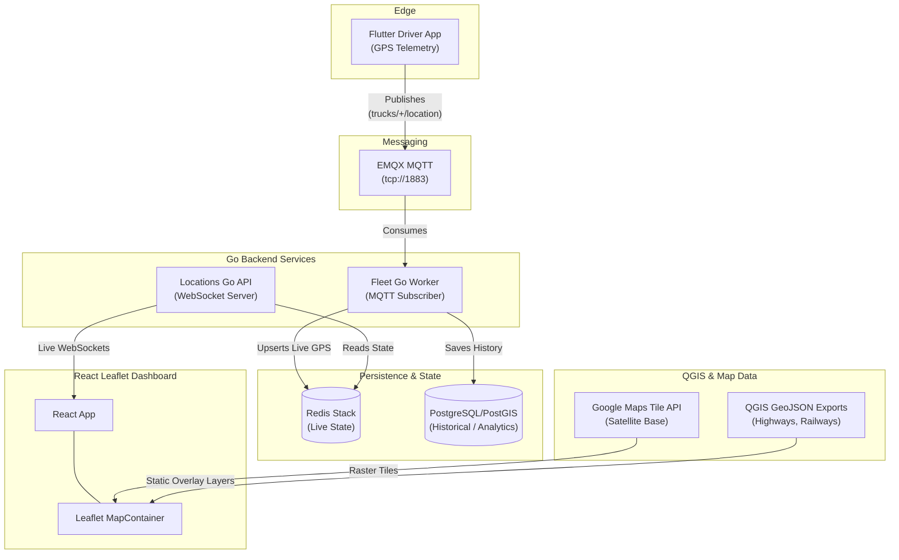

# FleetTrack Architecture (v2)

This document outlines the current architecture for the FleetTrack system. The architecture has been refined to prioritize **developer productivity, fast iteration, and simplified map data pipelines**.

## The Hybrid Approach

The core backend pipeline leverages our battle-tested, high-performance infrastructure (MQTT, Go, Redis, PostGIS). However, the frontend mapping engine has been replaced. 

We have **removed MapLibre and the Martin Vector Tile Server** from the stack, replacing them with a **React Leaflet + Direct GeoJSON** approach. 

### Why the change?
The previous MapLibre + Martin stack required complex vector tile processing (`tippecanoe`), convoluted Mapbox Style JSON configurations, and significant overhead just to change the color of a road or add a new rail yard.

By switching to Leaflet, our mapping workflow is now directly aligned with **QGIS**:
1. **Fast Prototyping:** We build and trace map layers (railways, roads, yards) directly in QGIS.
2. **Direct Export:** We export these layers from QGIS as GeoJSON into our `docs/maps` (and `public/geojson`) folder.
3. **Instant Rendering:** Leaflet consumes these GeoJSON files natively over HTTP and renders them using simple JavaScript styling.
4. **Result:** What used to take hours of vector tile debugging now takes 30 seconds. It is incredibly fast and highly productive for building out custom port and transit infrastructure maps.

---

## System Diagram

## Component Breakdown

1. **Ingestion Layer:**
   - **Flutter App:** Streams location data.
   - **EMQX MQTT:** High-throughput message broker handling telemetry streams.

2. **Backend Processing:**
   - **Go Worker:** Subscribes to MQTT topics, parses telemetry, and maintains the current state of the fleet.
   - **Redis Stack:** Acts as the ultra-fast in-memory state store for live vehicle coordinates.
   - **PostGIS:** Persists historical trails and handles complex spatial queries (geofencing).
   - **Go Locations API:** Exposes WebSockets to the frontend, pushing live Redis updates to the browser at 60fps.

3. **Frontend (The New Mapping Stack):**
   - **React:** Manages dashboard state and WebSocket connections.
   - **Google Satellite Tiles:** Provides the rich, photographic base layer.
   - **Static GeoJSON Overlays:** The QGIS-generated files (`railway_line.geojson`, `highway_line.geojson`) are served directly by Nginx.
   - **React Leaflet:** Combines the Google basemap, the QGIS GeoJSON roads, and the live WebSocket vehicle markers into a single, cohesive, high-performance UI. 
